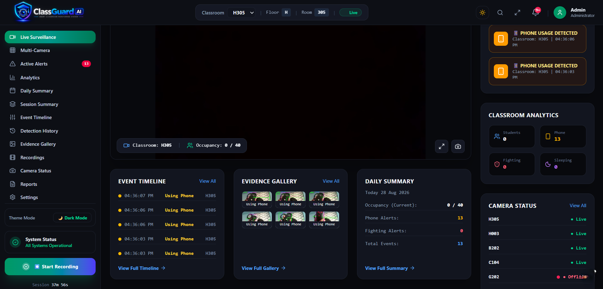
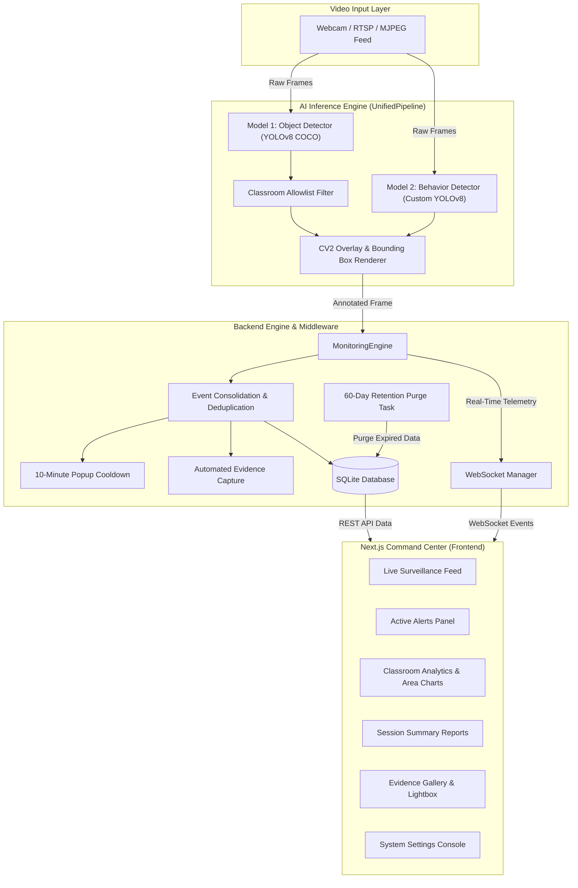

<div align="center">

# 🎓 AI-Based Smart Classroom Monitoring System
### *Real-Time Autonomous Surveillance, Behavioral Intelligence & Multi-Classroom Command Center*

[](https://fastapi.tiangolo.com/)
[](https://nextjs.org/)
[](https://www.typescriptlang.org/)
[](https://www.python.org/)
[](https://docs.ultralytics.com/)
[](https://pytorch.org/)
[](https://www.sqlite.org/)
[](LICENSE)

---



</div>

---

## 📌 Executive Summary & Problem Statement

Educational institutions face significant challenges maintaining real-time awareness of classroom safety, student engagement, and behavioral dynamics across multiple academic blocks and laboratories. Traditional manual monitoring or passive CCTV recording fails to provide immediate actionable insights during critical incidents such as physical altercations, severe disengagement, or unauthorized phone usage.

The **AI-Based Smart Classroom Monitoring System** addresses this problem by delivering an automated, end-to-end computer vision and behavioral intelligence platform. Powered by a **Dual-Model YOLO Pipeline**, the system processes live camera streams in real-time to compute classroom occupancy, filter essential educational equipment, detect seven specific student behaviors, issue immediate emergency alerts, capture automated screenshot evidence, record monitoring sessions, and compile comprehensive daily and session analytics.

---

## ✨ Key Capabilities & Highlights

| Feature Area | System Capability |
| :--- | :--- |
| 📹 **Live Surveillance** | Low-latency live MJPEG stream with real-time AI bounding box overlays, occupancy counter, FPS indicator, and active fighting status banners. |
| 🚨 **Behavior Detections** | Real-time classification of 7 specific behaviors: `Fighting`, `Sleeping`, `Using Phone`, `Reading`, `Writing`, `Hand Raising`, and `Eating`. |
| ⚡ **Priority Fighting Alert** | High-priority red full-screen alert modal with automated evidence capture and instant audio-visual notification upon physical altercation detection. |
| 📱 **Phone Usage Alerts** | Automated policy violation alerts triggered when cell phone presence coincides with active phone usage behavior. |
| 🛡️ **Alert Flooding Protection** | Built-in 10-minute (600-second) popup cooldown per classroom/alert type and ongoing event consolidation to prevent alert fatigue. |
| 📊 **Interactive Analytics** | Multi-day analytics with custom interactive SVG area charts, Y-axis scales, hover tooltips, and behavior distribution bars. |
| 📋 **Session Reports** | Auto-synthesized and manual session summaries detailing peak/average occupancy, event timelines, evidence galleries, and MP4 video recordings. |
| 📷 **Evidence & Retention** | Automatic evidence screenshot capture on events with 60-day automatic data purge policy and a manual *"Keep Forever"* protection toggle. |
| ➕ **Classroom Management** | 2-step dynamic classroom/camera onboarding wizard supporting webcam indices, RTSP feeds, and test video files. |
| 📄 **PDF Report Generator** | Automated server-side PDF executive report generation via ReportLab detailing room activity, event logs, and occupancy graphs. |

---

## 🏗️ System Architecture

The application is structured into decoupled layers for AI model inference, real-time event monitoring, relational data storage, and the web frontend.



---

## 🧠 Dual-Model AI Architecture

The system enforces a strict **Dual-Model Inference Architecture** loaded once at application startup and reused across processing loops.

```
Input Video Frame (BGR 640x640)
       │
       ├───> Model 1: Object Detection (YOLOv8 Base) ───────> Classroom Allowlist Filter ──> Objects & Occupancy
       │
       └───> Model 2: Behavior Detection (Custom YOLOv8) ───> 7 Behavior Classes ──────────> Behaviors & BBoxes
                                                                                                  │
                                                                                                  ▼
                                                                                       Unified Pipeline & Overlay
```

### Model 1 — Object Detection
* **Model Baseline**: Pretrained YOLOv8 (`yolov8n.pt`).
* **Dataset Scope**: Full COCO 2017 80 classes.
* **Essential Classroom Allowlist**: To prevent clutter and misclassifications (e.g. clocks mapped to donuts), exposed detections are strictly filtered by a configurable allowlist:

$$\text{Allowlist} = \{\text{Person, Chair, Table, Laptop, Monitor, Keyboard, Mouse, Cell Phone, Book, Backpack, Bottle, Cup, Clock, Scissors, Handbag}\}$$

* **Occupancy Logic**: Real-time person count is derived strictly from allowlisted `Person` detections.

### Model 2 — Behavior Detection
* **Model Baseline**: Custom Fine-Tuned YOLOv8 (`models/behavior_yolo.pt`).
* **Classes (7 Target Behaviors)**:

```text
0: Fighting       (High-priority critical alert)
1: Sleeping       (Disengagement event)
2: Using Phone    (Policy violation alert)
3: Reading        (Academic engagement)
4: Writing        (Academic engagement)
5: Hand Raising   (Interactive participation)
6: Eating         (Classroom activity)
```

* **False Fighting Protection**: Built-in validation guarantees that missing predictions, generic person detections, or model exceptions **never** default to `Fighting`. `Fighting` is produced strictly when Model 2 predicts class ID `0`.

---

## 📊 Dataset Context & Model Fine-Tuning

### 1. Object Detection Dataset
* **Source**: COCO 2017 Dataset.
* **Volume**: 20,000 Training images | 4,000 Validation images | 4,000 Test images.
* **Classes**: 80 COCO classes filtered dynamically via `CLASSROOM_OBJECT_ALLOWLIST`.

### 2. Behavior Detection Dataset
* **Source Repositories**: Merged from `datasets/behavior_detection-fight/` and `datasets/behavior_detection-phone/`.
* **Merged Dataset Target**: `datasets/behavior_detection/` (`train/`, `val/`, `test/`).
* **Class Mapping Script**: `merge_behavior_datasets.py` deterministically remaps raw source annotations into the 7 standard behavior classes.

---

## 🛠️ Tech Stack Matrix

| Layer | Technologies & Libraries |
| :--- | :--- |
| **Frontend Framework** | **Next.js 16** (App Router), **React 19**, **TypeScript** |
| **Styling & UI** | **Tailwind CSS**, Vanilla CSS tokens, **Lucide React** icons |
| **Backend Framework** | **FastAPI** 0.110+, **Uvicorn** 0.28+, **Pydantic v2** |
| **AI / Machine Learning** | **YOLOv8** (Ultralytics v8.4+), **PyTorch** 2.13+, **OpenCV** 4.9+ |
| **Real-Time Data** | **WebSockets** (Native FastAPI + Client Auto-Reconnection Protocol) |
| **Database & Persistence**| **SQLite3** (WAL mode), Thread-safe connections, Modular abstraction |
| **Report Generation** | **ReportLab** 4.1+ (PDF canvas, dynamic tables & flowables) |
| **Process Management** | Windows PowerShell batch scripts (`start_all.bat`, `run_backend.bat`) |

---

## 🖥️ Command Center Interface Breakdown

The Command Center is engineered as a modern monitoring console.

```
┌────────────────────────────────────────────────────────────────────────────────────────┐
│ COMMAND CENTER                                                       🔔 Notifications │
├───────────────┬────────────────────────────────────────────────────────────────────────┤
│ 📺 Live       │                                                                        │
│ 🎛️ Multi-Cam  │                      LIVE SURVEILLANCE FEED                            │
│ 🚨 Alerts     │                   (Stream + Bounding Overlays)                         │
│ 📊 Analytics  │                                                                        │
│ 📅 Daily      ├───────────────────────────────────┬────────────────────────────────────┤
│ 📑 Session    │  Current Occupancy & Stats        │  Active Alerts & Behavior Log      │
│ ⏱️ Timeline   │  • Occupancy: 4 Persons           │  • 🚨 Fighting Alert (Room H305)   │
│ 🖼️ Evidence   │  • Peak: 7 Persons                │  • 📱 Phone Usage (Room H305)      │
│ 🎥 Recordings │  • Active Feed: Online            │  • 📖 Reading (Room H305)          │
│ ⚙️ Settings   └───────────────────────────────────┴────────────────────────────────────┘
└───────────────┴────────────────────────────────────────────────────────────────────────┘
```

1. **Live Surveillance Feed** *(Default Landing Page)*: Real-time low-latency video streaming, classroom identity header, camera status indicator, occupancy metrics, active alert banners, and quick action bar.
2. **Multi-Camera Overview**: Grid view of all configured classrooms with live preview thumbnails and alert count indicators.
3. **Active Alerts Panel**: Filtered list of pending alerts with quick navigation to live feed and persistent database dismissal.
4. **Classroom Analytics**: Long-term trends featuring Google Analytics-style interactive SVG area charts, Y-axis scales, hover tooltips, and behavior distribution bars.
5. **Daily Summary**: Date-filtered operational report showing total daily events, peak occupancy, alert tallies, daily event timeline, evidence, and recordings.
6. **Session Summary**: Single-monitoring session report detailing start/end timestamps, session duration, average occupancy, event breakdown, timeline, evidence screenshots, and MP4 video playback/downloads.
7. **Evidence Gallery**: Grid view of captured evidence screenshots with filtering by classroom/date, lightbox modal, and *"Keep Forever"* protection.
8. **Recordings View**: Session recording management with inline HTML5 video player, duration metrics, and MP4 downloading.
9. **Camera Status & Onboarding**: Table of camera device status with a 2-step **Add Classroom / Lab Modal** (Classroom identity $\rightarrow$ Camera source URL setup).
10. **PDF Reports Center**: On-demand PDF monitoring report generator.
11. **System Settings Console**: Full administration control panel featuring confidence threshold sliders, object allowlist toggles, 10-minute popup cooldown rules, hardware acceleration stats, and manual 60-day data retention purge controls.

---

## 📁 Repository Directory Structure

```text
Smart-Classroom-Monitoring/
├── backend/
│   ├── api/                      # Reserved API routing submodules
│   ├── main.py                   # FastAPI Application, REST routes & WebSocket server
│   ├── models/
│   │   └── schemas.py            # Pydantic data validation models
│   ├── monitoring/
│   │   └── monitoring_engine.py  # Core Monitoring Engine (Deduplication & Cooldowns)
│   ├── services/
│   │   └── report_generator.py   # ReportLab PDF report builder
│   └── storage/
│       ├── database.py           # SQLite persistence layer & queries
│       └── cleanup_dev_data.py   # Development data reset script
├── config/
│   └── config.py                 # Central configuration, allowlist, & thresholds
├── datasets/
│   ├── object_detection/         # COCO dataset directory
│   ├── behavior_detection-fight/ # Raw Fighting behavior dataset
│   ├── behavior_detection-phone/ # Raw Phone behavior dataset
│   └── behavior_detection/       # Merged 7-class behavior dataset
├── frontend/                     # Next.js Command Center App
│   ├── public/                   # Static SVG assets & icons
│   ├── src/
│   │   ├── app/
│   │   │   ├── globals.css       # Design tokens, Tailwind CSS, & animations
│   │   │   ├── layout.tsx        # App root layout
│   │   │   └── page.tsx          # Main Command Center router page
│   │   ├── components/           # Modular UI Components
│   │   │   ├── ActiveAlertsPanel.tsx
│   │   │   ├── AddClassroomModal.tsx
│   │   │   ├── CameraStatusView.tsx
│   │   │   ├── ClassroomAnalyticsView.tsx
│   │   │   ├── EventTimelineHistory.tsx
│   │   │   ├── EvidenceGallery.tsx
│   │   │   ├── Header.tsx
│   │   │   ├── LiveSurveillanceFeed.tsx
│   │   │   ├── MultiCameraOverview.tsx
│   │   │   ├── RecordingsView.tsx
│   │   │   ├── ReportsCenter.tsx
│   │   │   ├── SettingsView.tsx
│   │   │   └── Sidebar.tsx
│   │   ├── lib/
│   │   │   └── api.ts            # Client API, WebSocket client & reconnect logic
│   │   └── types/
│   │       └── index.ts          # Central TypeScript interfaces
│   └── tsconfig.json             # TypeScript configuration
├── inference/
│   ├── object_detector.py        # Model 1: YOLO Object Detector & Allowlist Filter
│   ├── behavior_detector.py      # Model 2: YOLO Behavior Detector & Validation
│   └── unified_pipeline.py       # Dual-Model Orchestrator & OpenCV Overlay Renderer
├── models/
│   ├── yolov8n.pt                # Base YOLOv8 object detector weights
│   └── behavior_yolo.pt          # Fine-tuned 7-class behavior detector weights
├── recordings/                   # Stored session MP4 video files
├── reports/                      # Generated PDF monitoring reports
├── screenshots/                  # Captured evidence JPEG screenshots
├── training/
│   └── train_behavior_model.py   # YOLOv8 behavior model fine-tuning script
├── .gitignore                    # Git exclude rules
├── APP_FLOW.md                   # Application navigation & flow spec
├── GEMINI.md                     # Core project rules & standards
├── merge_behavior_datasets.py    # Dataset merging & remapping utility
├── PRD.md                        # Product Requirements Document
├── README.md                     # Project documentation
├── requirements.txt              # Python dependencies
├── run_backend.bat               # Windows batch launcher for backend
├── run_frontend.bat              # Windows batch launcher for frontend
├── start_all.bat                 # One-click dual service launcher
└── TECH_STACK.md                 # Technical stack specification
```

---

## ⚡ Setup & Installation Guide

### Prerequisites
* **Python**: 3.10 or 3.11
* **Node.js**: 18.0 or higher
* **npm**: 9.0 or higher

### 1. Repository Setup & Python Virtual Environment
```bash
# Clone the repository
git clone https://github.com/rukeshsg/AI-Smart-Classroom-Monitoring-System.git
cd AI-Smart-Classroom-Monitoring-System

# Create and activate Python virtual environment
python -m venv venv

# Windows PowerShell:
.\venv\Scripts\activate

# Linux/macOS:
source venv/bin/activate

# Install Python backend dependencies
pip install -r requirements.txt
```

### 2. Frontend Installation & Build
```bash
cd frontend
npm install

# Verify production build
npm run build
cd ..
```

---

## 🚀 Running the Application

### Option A: One-Click Launcher (Windows Recommended)
Simply double-click **`start_all.bat`** in the project root folder. This automatically launches both the FastAPI backend and Next.js frontend in separate windows.

### Option B: Terminal Command Launch

#### Terminal 1 — FastAPI Backend:
```bash
.\venv\Scripts\python.exe -m uvicorn backend.main:app --reload --host 0.0.0.0 --port 8000
```
* **API Documentation (Swagger UI)**: `http://localhost:8000/docs`
* **Health Endpoint**: `http://localhost:8000/api/health`

#### Terminal 2 — Next.js Command Center:
```bash
cd frontend
npm run dev
```
* **Command Center Web Application**: `http://localhost:3000`

---

## 🔌 API & WebSocket Reference

### Key REST API Endpoints

| Method | Endpoint | Description |
| :--- | :--- | :--- |
| `GET` | `/api/health` | Returns backend operational status & loaded model information. |
| `GET` | `/api/classrooms` | Retrieves all registered classrooms and camera statuses. |
| `POST` | `/api/classrooms` | Registers a new classroom and camera device. |
| `GET` | `/api/video_feed/{classroom_id}` | Streams real-time annotated MJPEG video feed. |
| `GET` | `/api/events` | Queries event logs filtered by classroom, date, or event type. |
| `GET` | `/api/alerts` | Fetches active and recent alerts. |
| `DELETE`| `/api/alerts/{id}` | Dismisses and deletes an alert record. |
| `GET` | `/api/evidence` | Retrieves captured evidence items filtered by classroom/date. |
| `DELETE`| `/api/evidence/{id}` | Deletes an evidence item and unlinks its image file. |
| `POST` | `/api/evidence/{id}/permanent` | Toggles *"Keep Forever"* protection on an evidence item. |
| `GET` | `/api/sessions` | Lists monitoring sessions for a classroom. |
| `GET` | `/api/sessions/{id}` | Returns detailed session report with joined events and media. |
| `GET` | `/api/analytics/classroom` | Computes multi-day analytics & daily event totals. |
| `POST` | `/api/reports/generate` | Generates a server-side PDF monitoring report. |
| `POST` | `/api/cleanup/retention` | Triggers manual 60-day data retention purge. |

### Real-Time WebSocket Channel
* **Endpoint**: `ws://localhost:8000/ws/live/{classroom_id}`
* **Payload Structure**:
```json
{
  "event": "occupancy_update",
  "classroom_id": "H305",
  "occupancy": 4,
  "peak_occupancy": 7,
  "events": [...],
  "alerts": [...],
  "active_fighting": {
    "is_active": false,
    "classroom_id": "H305"
  }
}
```

---

## 🔒 Security, Privacy & Data Retention

1. **60-Day Automatic Data Retention**: Unprotected evidence screenshots and session recordings older than 60 days are automatically purged via background database maintenance tasks to conserve storage.
2. **"Keep Forever" Protection**: Users can explicitly toggle `is_permanent = True` on critical evidence items or recordings, exempting them from automatic retention purging.
3. **Local Storage Privacy**: Surveillance video streams, screenshots, and database files remain strictly local by default during operation.
4. **Path Sanitization**: All file interactions sanitize classroom IDs and file paths to prevent directory traversal vulnerabilities.

---

## 🧪 Testing & Verification

The repository includes explicit verification steps:

```bash
# Test Database Operations & Session Fallbacks
python -c "from backend.storage.database import init_db, get_classrooms_db; init_db(); print('Classrooms:', get_classrooms_db())"

# Verify Unified AI Pipeline Inference
python -c "from inference.unified_pipeline import UnifiedPipeline; import numpy as np; p = UnifiedPipeline(); res = p.process_frame(np.zeros((480, 640, 3), dtype=np.uint8)); print('Objects:', res['objects']); print('Behaviors:', res['behaviors'])"

# Test Frontend Build & TypeScript Check
cd frontend
npm run build
```

---

## 📜 License & Credits

This project is licensed under the **MIT License**.

Developed for **AI-Based Smart Classroom Monitoring & Operational Safety**. Special thanks to the Ultralytics YOLOv8 team, FastAPI developers, and Next.js open-source maintainers.